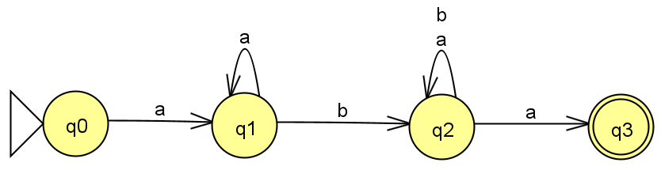
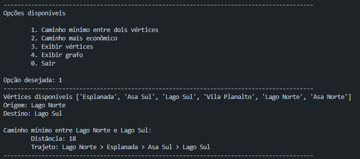
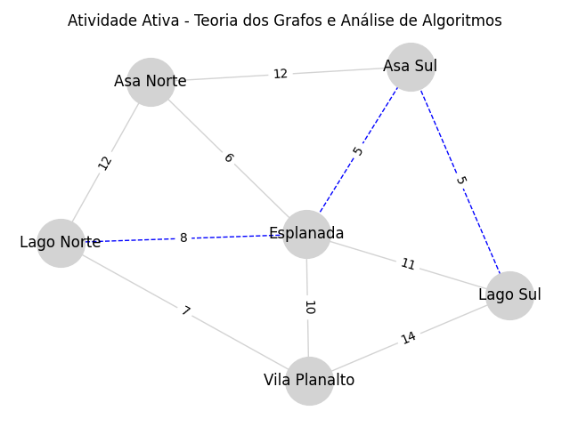
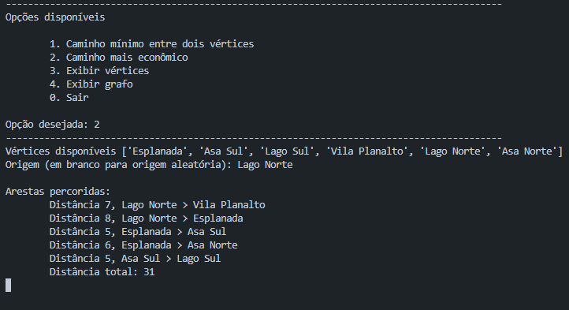
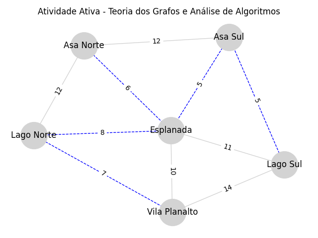

# Estruturas
Repositório para estruturas e conceitos construídos com POO.

# Tópicos
- [Testes](#testes)
- [ANFs](#afns)
- [Grafos](#grafos)

# Testes
A fim de facilitar a utilização, os algoritmos em C++ estão compilados e disponíveis em [tests](/tests/), contendo um arquivo executável para Windows.

# AFNs
Autômatos Finitos Não Determinísticos são modelos computacionais utilizados em processos como a validação de expressões ou gramáticas regulares, 
os quais permitem a análise de cadeias a partir de um conjunto de estados finitos e um alfabeto.

O algoritmo contido na pasta [afn](/afn/) foi escrito em C++ e permite a validação de cadeias de caracteres a partir de uma estrutura de Autômato Finito válida. O exemplo foi baseado na expressão regular `aa*(a+b)*a`:

> Exemplo de Autômato Finito Não Determinístico

Analogamente, o modelo em C++ [`afn\main.cpp`](afn/main.cpp) foi representado utilizado uma `struct` e `std::vector`:
```C++
// definindo estrutura do AFN
std::vector<relacaoEstado> regras {
    { "q0", 'a', "q1" },
    { "q1", 'a', "q1" },
    { "q1", 'b', "q2" },
    { "q2", 'a', "q2" },
    { "q2", 'b', "q2" },
    { "q2", 'a', "q3" },
};
std::string inicial = "q0";
std::vector<std::string> finais { "q3" };
```

# Grafos
Um grafo é uma estrutura de dados capaz de representar relações entre entidades, onde sua composição inclui vértices – representam as entidades ou objetos – e arestas – representam as relações entre os vértices. Os grafos podem ser divididos em grupos, cada qual com suas próprias características.

A pasta [grafos](/grafos/) conta com um algoritmo escrito em Python utilizado em um trabalho acadêmico, o qual fornece um menu por linha de comando e permite que o usuário realize operações em um grafo pré-definido. Para as análises de caminho mínimo e caminho mais econômico foram utilizados os algoritmos de Bellman-Ford e Prim, respectivamente.

Exemplos

Entrada - Linha de comando



Saída - Caminho de menor custo entre Lago Norte e Lago Sul




Entrada - Linha de Comando



Saída - Caminho mais econômico entre todos os pontos


